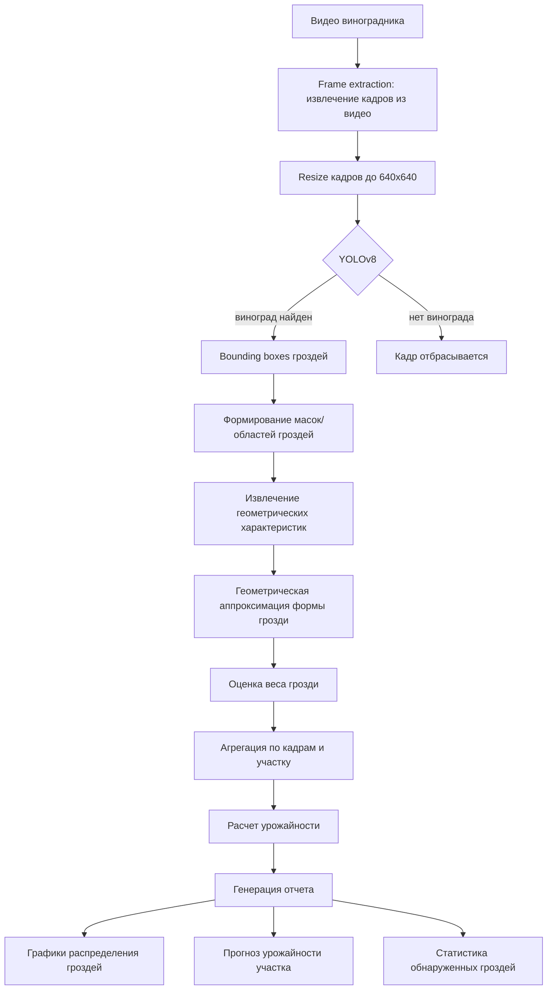
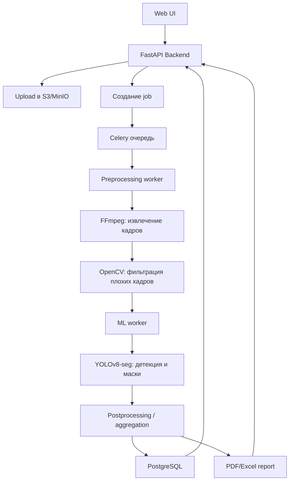

# ML System Design Doc - [RU]
## Дизайн ML системы - \<Fruitinspect - система прогнозирования урожая виноградников\> \<MVP\> \<1\>

### 1. Цели и предпосылки 
#### 1.1. Зачем идем в разработку продукта?  
Бизнес-цель 

Основная цель разработки продукта — снизить финансовые потери винодельческих хозяйств, возникающие из-за неточного прогнозирования урожайности винограда.

> ## Фин эффект пример для винодельни 150Га 

> - Если прогноз 700т урожая а по факту 600т (ошибка 15%):
> -  1. Переплата рабочим (40-60% экономии):
   50 сборщиков × 60000 руб = 3 млн → переплата 450000 руб
   С FruitInspect подписка: 200000 руб → ЭКОНОМИЯ 250000 руб (45%)
> - 2. Избыточная тара (50% экономии):
   35000 ящиков × 50р = 1.75 млн → переплата 350000 руб  
   С FruitInspect: 150000 руб → ЭКОНОМИЯ 200000 руб (55%)
> - 3. Простой переработки (30-50%):
   Фиксировано 10 млн → недозагрузка 1.5 млн руб
   С FruitInspect: 700000 руб → ЭКОНОМИЯ 800000 руб (45%)
> - 4. Лишние закупки сырья (-50%):
   200т × 60000/т = 12 млн → перезакупка 2.4 млн руб  
   С FruitInspect: 1.2 млн руб → ЭКОНОМИЯ 1.2 млн руб (50%)
> - ИТОГО ЭКОНОМИЯ: 2.45 млн руб/сезон (52%)

На текущий момент оценка урожайности выполняется вручную агрономами и основывается на выборочных осмотрах виноградников. Такой подход:

	-	занимает много времени,
	-	зависит от субъективной оценки специалиста,
	-	часто дает значительную погрешность.
Из-за неточных прогнозов компании сталкиваются со следующими проблемами:

	-	избыточный найм сезонных рабочих,
	-	закупка лишней тары для сбора урожая,
	-	недозагрузка или перегрузка производственных мощностей,
	-	неэффективные закупки дополнительного сырья.

Почему станет лучше, чем сейчас

Использование автоматизированного анализа видеосъемки позволяет получать более точную и объективную оценку урожайности, чем ручные методы.
Основные улучшения для бизнеса:
1. Повышение точности планирования
   
   более точная оценка урожая позволяет заранее корректно планировать ресурсы и снижать избыточные расходы.
2. Быстрое получение результата
   
   анализ одного участка виноградника занимает несколько минут, тогда как ручная оценка может занимать несколько дней.
3. Снижение зависимости от человеческого фактора
   
   результаты оценки становятся более стабильными и не зависят от опыта конкретного специалиста.
4. Масштабируемость
   
   система позволяет анализировать большие площади виноградников без пропорционального увеличения затрат на персонал.

Что будем считать успехом итерации с точки зрения бизнеса 

1. Снижение ошибки прогнозирования урожайности
2. Экономический эффект для клиента
3.  Удобство использования
4.  Подтверждение интереса рынка

#### 1.2. Бизнес-требования и ограничения
Краткое описание БТ и ссылки на детальные документы с бизнес-требованиями 

Основная цель проекта — создать цифровой сервис, который позволяет винодельческим хозяйствам быстро и точно оценивать ожидаемый объем урожая винограда на основе видеосъемки виноградников.

Система должна позволять клиенту:

	1.	Загружать видео виноградников, снятое с наземной техники.
	2.	Получать автоматический анализ видеоматериала.
	3.	Получать прогноз урожайности для участка виноградника.
	4.	Использовать результаты прогноза для планирования: количества рабочих на сбор урожая, объема необходимой тары, загрузки перерабатывающих мощностей, закупки дополнительного сырья.

Результат анализа должен предоставляться в виде простого отчета, содержащего:

	-	оценку урожайности на гектар,
	-	общую оценку урожая участка,
	-	визуальную карту распределения урожая по полю.
Бизнес-ограничения

Ограничения данных

	-	доступность размеченных данных ограничена,
	-	видеосъемка может выполняться в разных условиях освещения,
	-	различия между сортами винограда могут влиять на внешний вид гроздей.
 
Технологические ограничения

	-	анализ видео должен выполняться достаточно быстро, чтобы быть полезным в операционном планировании,
	-	система должна работать с распространенными форматами видео.
 
Бизнес-ограничения

	-	стоимость использования сервиса должна оставаться экономически выгодной для винодельни,
	-	решение должно быть масштабируемым и применимым для хозяйств различного размера.
 
Что мы ожидаем от конкретной итерации 

Цель текущей итерации — разработать минимально жизнеспособную версию продукта (MVP), которая позволит проверить ценность решения на реальных данных клиентов.
В рамках итерации планируется:

	-	разработать систему анализа видео виноградников (детекция винограда с кадров полученного видеоматериала),
	-	реализовать базовый алгоритм оценки урожайности,
	-	протестировать систему на ограниченном количестве реальных виноградников,
	-	подготовить отчеты с результатами анализа.
 
Что считаем успешным пилотом? Критерии успеха и возможные пути развития проекта 

Пилот считается успешным при выполнении следующих условий:
1. Подтверждение точности прогнозирования
   
Прогноз урожайности должен быть значительно точнее текущих ручных оценок, используемых агрономами
2. Подтверждение экономического эффекта

Использование системы должно позволить клиенту сократить потери, связанные с ошибками планирования урожая.
3. Положительная обратная связь пользователей

Пользователи должны подтверждать, что результаты анализа полезны для планирования производства.
4. Готовность клиента продолжить использование сервиса

По итогам пилота клиент должен быть заинтересован в дальнейшем использовании продукта.

#### 1.3. Что входит в скоуп проекта/итерации, что не входит

На закрытие каких БТ подписываемся в данной итерации

	-	анализ видеосъемки виноградников,
	-	автоматическое обнаружение гроздей винограда на видео,
	-	оценку количества гроздей,
	-	расчет приблизительного объема урожая,
	-	формирование отчета для пользователя
 
Что не будет закрыто Data Scientist

	-	прогнозирование качества винограда,
	-	прогнозирование сахаристости ягод,
	-	рекомендации по агротехнологиям,
	-	оптимизация процессов производства вина,
	-	интеграция с внутренними информационными системами винодельни.
 
Описание планируемого технического долга 

	-	использование ограниченного объема обучающих данных,
	-	упрощенная архитектура обработки видео,
	-	отсутствие полной автоматизации инфраструктуры обработки данных,
	-	ограниченные возможности масштабирования системы.
 
#### 1.4. Предпосылки решения
1.	Существует связь между визуальными характеристиками виноградника и объемом урожая.
Количество и размер гроздей, наблюдаемых на видео, позволяет оценить общий объем урожая.
2.	Видео виноградника содержит достаточно информации для анализа.
Съемка с дронов или наземной техники позволяет зафиксировать значительную часть гроздей на лозах.
3.	Выборка видеоматериалов является репрезентативной.
Видео охватывает различные участки виноградника и отражает реальное распределение урожая.
4.	Точность автоматического анализа может быть достаточной для задач планирования.
Даже приблизительная оценка урожая может значительно улучшить планирование ресурсов по сравнению с ручными методами.

# 2. Data Science часть

## 2.1 Постановка задачи

С технической точки зрения задача заключается в **прогнозировании урожайности виноградников на основе анализа видеоданных**.

## 2.2 Блок-схема решения

  
## 2.3 Этапы решения задачи

# Этап 1 — Подготовка и предобработка данных

На первом этапе выполняется подготовка данных для обучения и тестирования моделей детекции виноградных гроздей.

В рамках проекта рассматриваются два уровня реализации:

- **Baseline** — работа с существующими датасетами изображений
- **MVP** — система обработки видеоданных виноградников

# Baseline

На этапе baseline используются **существующие датасеты изображений виноградных гроздей**.

Данные представляют собой:

- фотографии виноградных гроздей
- разметку объектов (bounding boxes)
- сегментационные маски гроздей (в некоторых датасетах)

Bounding boxes используются для задачи детекции объектов, а сегментационные маски позволяют более точно определить форму и площадь грозди, что важно для последующей оценки массы.

Все изображения приведены к единому формату:

- размер изображений **640×640**
- RGB формат

Размер **640×640** выбран, поскольку он является стандартным входным разрешением для моделей семейства YOLO и обеспечивает баланс между точностью детекции и скоростью обработки.

### Таблица источников данных

| Название данных | Есть ли данные в компании (если да, название источника/витрин) | Требуемый ресурс для получения данных (какие роли нужны) | Проверено ли качество данных |
|---|---|---|---|
| Dataset изображений виноградных гроздей | Нет (используются открытые датасеты) | Data Scientist | Частично |
| Разметка bounding boxes | Да (в составе датасета) | Data Scientist | Да |
| Сегментационные маски гроздей | Да (в некоторых датасетах) | Data Scientist | Частично |

### Предобработка данных

Перед обучением модели выполняются следующие шаги:

1. очистка датасета  
2. удаление поврежденных изображений  
3. приведение изображений к размеру **640×640**  
4. проверка корректности разметки  
5. преобразование аннотаций в формат YOLO  

### Разделение данных

Данные разделяются на три выборки:

- **Train — 70%**
- **Validation — 20%**
- **Test — 10%**

### Результат этапа Baseline

- подготовленный датасет изображений
- корректная разметка объектов
- сформированные train/validation/test выборки

# MVP

На этапе MVP предполагается использование **видеоданных виноградников**.

Источниками данных могут выступать:

- видеосъемка с наземной техники (трактор / ровер)

Видео позволяет получить значительно больше данных по сравнению с одиночными изображениями и обеспечивает покрытие всего виноградного участка.

### Таблица источников данных

| Название данных | Есть ли данные в компании (если да, название источника/витрин) | Требуемый ресурс для получения данных (какие роли нужны) | Проверено ли качество данных |
|---|---|---|---|
| Видео виноградников | Нет (планируется сбор данных) | Data Engineer / Data Scientist | Нет |
| Кадры видео | Нет | Data Engineer | Нет |
| Разметка гроздей | Нет | Data Annotator | Нет |

### Подготовка видеоданных

Обработка видеоданных включает следующие этапы:

1. извлечение кадров из видео  
2. фильтрацию кадров (удаление нерелевантных кадров)  
3. приведение кадров к размеру **640×640**  
4. разметку гроздей винограда  

Для извлечения кадров из видео может использоваться инструмент **FFmpeg**.

### Формирование датасета

После извлечения кадров выполняется:

- разметка **bounding boxes**
- разметка **сегментационных масок гроздей**
- проверка качества разметки
- формирование обучающей выборки

Использование сегментационных масок позволяет более точно оценивать площадь и форму грозди, что необходимо для последующей геометрической аппроксимации и оценки массы.

### Результат этапа MVP

- набор размеченных кадров виноградников
- датасет с bounding boxes и сегментационными масками
- подготовленный набор данных для обучения моделей детекции и сегментации
- расширение обучающей выборки за счет видеоданных

# Этап 2 — Детекция гроздей винограда

На данном этапе выполняется обнаружение гроздей винограда на изображениях.

Цель этапа — определить положение каждой грозди на изображении и выделить область объекта для дальнейшего анализа геометрических характеристик.

В рамках проекта рассматриваются два уровня реализации:

- **Baseline** — использование существующих аннотаций датасета
- **MVP** — автоматическая детекция и сегментация гроздей на видеоданных

# Baseline

В baseline решении этап детекции в значительной степени упрощен,
поскольку используемые датасеты уже содержат готовую разметку.

Датасет включает:
-  **bounding boxes**
- **сегментационные маски** гроздей

Таким образом, положение и форма объектов уже известны.
В рамках baseline выполняются следующие действия:
1. проверка корректности изображений
2. проверка корректности аннотаций
3. приведение данных к единому формату
4. использование существующих аннотаций для дальнейших расчетов

Модель детекции в baseline не обучается, так как задача обнаружения объектов уже решена в исходном датасете.

Таким образом, этап детекции используется только как источник информации о положении объектов.

### Результат этапа Baseline

На выходе получаем:

- координаты гроздей
- сегментационные маски гроздей

Эти данные используются на следующем этапе для оценки геометрических характеристик и массы гроздей.

# MVP

В MVP решении выполняется полноценная автоматическая детекция гроздей винограда.

Исходными данными являются видеозаписи виноградников.
После извлечения кадров из видео выполняется обнаружение объектов
с использованием моделей компьютерного зрения.

Для решения задачи используется модель **YOLOv8-seg**.

YOLOv8-seg позволяет выполнять:

- **object detection** (bounding boxes)
- **instance segmentation** (маски объектов)

### Входные данные

- изображения виноградников
- размер изображения **640×640**
- RGB формат

### Выход модели

Модель возвращает:

- координаты bounding boxes
- сегментационные маски объектов
- confidence score обнаружения

Сегментационные маски позволяют выделить точную область грозди
на изображении.

### Метрики качества

Для оценки качества детекции используются следующие метрики:

- **mAP@0.5**
- **Precision**
- **Recall**
- **IoU (Intersection over Union)**

### Результат этапа MVP

На выходе получаем:

- координаты гроздей
- сегментационные маски объектов
- вероятность обнаружения объектов

Эти данные используются на следующем этапе для извлечения геометрических характеристик гроздей и оценки их массы.

# Этап 3 — Оценка размера и веса гроздей

На данном этапе выполняется оценка геометрических характеристик
виноградных гроздей и расчет их предполагаемой массы.

Основной задачей этапа является преобразование визуальной информации
(область объекта на изображении) в количественные характеристики:

- площадь грозди
- геометрические параметры
- приблизительный объём
- оценка массы

В рамках проекта рассматриваются два уровня реализации:

- **Baseline** — использование готовых сегментационных масок из датасета  
- **MVP** — использование масок, полученных моделью детекции

---

# Baseline

В baseline-решении используются **сегментационные маски**, которые уже присутствуют в исходном датасете.

Каждая маска представляет собой бинарное изображение, в котором:

- пиксели объекта имеют значение **1**
- пиксели фона имеют значение **0**

### Определение площади грозди

Площадь грозди вычисляется как количество пикселей,
принадлежащих маске объекта.

Формально площадь определяется как:

Area = N_pixels

где:

- **N_pixels** — количество пикселей, принадлежащих маске объекта.

### Извлечение геометрических характеристик

Из сегментационной маски извлекаются основные геометрические параметры грозди:

- высота грозди  
- верхний радиус  
- нижний радиус  
- площадь маски  

Высота определяется по вертикальному размеру маски,
радиусы оцениваются по ширине объекта в верхней и нижней части грозди.

### Геометрическая аппроксимация формы

Форма грозди аппроксимируется **усечённым конусом**.

Такое приближение выбрано потому, что большинство гроздей
имеют форму, близкую к конусообразной.

Использование простой геометрической модели
позволяет существенно упростить вычисления объёма.

### Оценка объёма

Объём грозди рассчитывается по формуле объёма усечённого конуса:

V = (1/3) * π * h * (R² + Rr + r²)

где:

- **h** — высота грозди  
- **R** — верхний радиус  
- **r** — нижний радиус  

Все величины рассчитываются в пиксельных координатах изображения.

### Оценка массы

Для перевода объёма в массу используется **калибровочный коэффициент**.

Коэффициент определяется на основе эталонной грозди,
для которой известны:

- реальный вес  
- рассчитанный объём.

Калибровочный коэффициент определяется как:

k = weight_reference / volume_reference

После этого масса каждой грозди оценивается как:

Weight = k * Volume

### Результат этапа Baseline

На выходе формируются следующие характеристики для каждой грозди:

- площадь грозди  
- геометрические параметры  
- оценка объёма  
- оценка массы

---

# MVP

В MVP-решении оценка размеров и массы выполняется
на основе **сегментационных масок, полученных моделью YOLOv8-seg**.

В отличие от baseline, где используются уже размеченные данные,
в MVP маски объектов формируются автоматически
в процессе обработки изображений или видеокадров.

### Основные шаги обработки

1. детекция гроздей винограда  
2. получение сегментационной маски объекта  
3. выделение области грозди  
4. вычисление площади объекта  
5. извлечение геометрических характеристик  
6. оценка объёма  
7. расчет массы

### Вычисление площади

Площадь объекта определяется как количество пикселей,
принадлежащих сегментационной маске.

### Геометрические характеристики

Из сегментационной маски автоматически извлекаются:

- высота грозди
- верхний радиус
- нижний радиус
- площадь объекта

Эти параметры используются для дальнейшей геометрической аппроксимации.

### Оценка объёма и массы

На основе извлечённых параметров выполняется:

1. геометрическая аппроксимация формы грозди  
2. расчет объёма  
3. перевод объёма в массу через калибровочный коэффициент.

### Результат этапа MVP

На выходе этапа формируются:

- оценка веса каждой обнаруженной грозди
- статистика распределения размеров гроздей
- агрегированные оценки урожайности участка виноградника.

Результаты могут использоваться для:

- оценки урожайности
- анализа состояния виноградника
- планирования сбора урожая.

# Этап 4 — Агрегация результатов и формирование отчётности

На данном этапе выполняется агрегирование результатов анализа
и формирование итоговых аналитических данных.

Цель этапа — преобразовать результаты детекции и оценки массы
в информацию, пригодную для анализа урожайности виноградника.

В рамках проекта рассматриваются два уровня реализации:

- **Baseline** — анализ отдельных изображений виноградника
- **MVP** — агрегированный анализ урожайности виноградника

---

# Baseline

В baseline решении анализ выполняется на уровне
отдельного изображения.

Каждое изображение представляет собой
небольшой участок виноградника,
на котором обнаруживаются грозди винограда.

Для каждой грозди вычисляются:

- высота
- радиусы
- объём
- оценка массы
- confidence детекции

После обработки всех объектов формируется
оценка урожайности для данного изображения.

Таким образом создаётся **локальная карта гроздей**.

Такая карта позволяет:

- визуализировать расположение гроздей
- оценить распределение массы гроздей
- анализировать форму и размеры объектов

Однако данный подход ограничен масштабом изображения
и не позволяет оценить урожайность всего виноградника.

---

# MVP

В MVP решении система масштабируется
на уровень всего виноградника.

Источником данных становится видеопоток
или серия изображений,
полученных при движении камеры
вдоль рядов виноградника.

После обработки каждого кадра
результаты агрегируются.

Таким образом выполняется:

- объединение данных по всем кадрам
- оценка количества гроздей
- оценка общей массы урожая
- построение карты урожайности виноградника

Результатом является **карта распределения урожая
по рядам виноградника**.

Это позволяет:

- выявлять зоны высокой урожайности
- выявлять зоны слабого плодоношения
- планировать сбор урожая
- оценивать эффективность агротехнических мероприятий.

---

# Результат этапа

На выходе системы формируются:

- оценка массы каждой грозди
- агрегированная оценка урожайности
- визуализация распределения гроздей
- аналитические отчёты.

# 3D визуализация гроздей

Для наглядного анализа формы объектов
строится трехмерная визуализация гроздей.

Каждая гроздь представляется в виде
аппроксимированной геометрической фигуры.

Параметры визуализации:

- высота грозди
- верхний радиус
- нижний радиус
- цвет объекта соответствует массе грозди

Такая визуализация позволяет:

- оценить форму гроздей
- сравнить размеры объектов
- визуально проверить корректность оценки веса.

# Агрегация данных

После обработки изображения для каждой обнаруженной грозди
формируется набор характеристик.

Основные параметры грозди:

- координаты объекта
- высота грозди
- верхний радиус
- нижний радиус
- объём грозди
- оценка массы
- confidence детекции

Все параметры сохраняются в структурированном виде
в таблицу данных.

Пример структуры данных:

| Параметр | Описание |
|---|---|
| cluster | номер грозди |
| height_px | высота грозди |
| R_px | верхний радиус |
| r_px | нижний радиус |
| volume_px3 | оценка объёма |
| estimated_weight_g | оценка веса |
| confidence | уверенность детекции |

# Оценка общей урожайности

После обработки всех объектов выполняется
агрегирование веса всех обнаруженных гроздей.

Общая масса определяется как:
- TotalWeight = Σ Weight_i ( оценка массы i грозди )
Полученное значение позволяет оценить
общую массу урожая на анализируемом изображении.

---

### Распределение веса гроздей

Гистограмма распределения веса показывает,
какие размеры гроздей преобладают на анализируемом участке виноградника.

Это позволяет определить структуру урожая:

- долю мелких гроздей
- долю средних гроздей
- долю крупных гроздей

**Практическая ценность:**

- позволяет оценить качество урожая
- помогает выявить участки с недостаточным развитием гроздей
- может указывать на проблемы с питанием лозы или условиями выращивания

**Целевая аудитория:**

- агрономы
- аналитики сельскохозяйственных данных
- специалисты по управлению виноградниками

---

### Связь объёма и веса

Диаграмма рассеяния показывает зависимость
между вычисленным объёмом грозди и её оценочной массой.

Данный график используется для проверки корректности
модели оценки массы.

Если модель работает корректно, между объёмом и весом
наблюдается положительная зависимость.

**Практическая ценность:**

- позволяет проверить корректность алгоритма оценки массы
- выявляет аномальные объекты (например, слишком тяжёлые или слишком лёгкие грозди)

**Целевая аудитория:**

- Data Scientist
- ML инженер
- исследователи компьютерного зрения

---

### Анализ формы гроздей

График зависимости верхнего и нижнего радиусов
характеризует геометрическую форму гроздей винограда.

Различные соотношения радиусов соответствуют
различным типам формы гроздей.

Анализ формы может быть полезен для:

- сравнения различных сортов винограда
- анализа плотности гроздей
- оценки морфологических характеристик урожая

**Практическая ценность:**

- позволяет анализировать морфологию гроздей
- может использоваться для сортового анализа винограда

**Целевая аудитория:**

- агрономы
- исследователи сельскохозяйственных культур
- аналитики агротехнических данных

---

### Связь высоты грозди с весом

Диаграмма показывает зависимость
между высотой грозди и её оценочной массой.

Этот анализ позволяет определить,
насколько высота грозди влияет на её массу.

График также позволяет выявлять:

- аномально длинные грозди
- компактные тяжёлые грозди

**Практическая ценность:**

- помогает определить важные признаки для оценки массы
- может использоваться для улучшения модели оценки веса

**Целевая аудитория:**

- Data Scientist
- ML инженеры
- специалисты по анализу данных

---

### Распределение confidence детекции

Гистограмма confidence отражает распределение
уверенности модели детекции объектов.

Confidence показывает вероятность того,
что обнаруженный объект действительно является
гроздью винограда.

Высокие значения confidence свидетельствуют
о корректной работе модели детекции.

Низкие значения могут указывать на:

- сложные условия съёмки
- частичные перекрытия гроздей
- ошибки модели

**Практическая ценность:**

- позволяет оценить качество модели детекции
- помогает выявить потенциальные ошибки модели

**Целевая аудитория:**

- ML инженеры
- специалисты по компьютерному зрению
- разработчики системы
# Результат этапа

На выходе системы формируются:

- оценка массы каждой грозди
- общая оценка урожайности
- аналитические графики
- структурированные данные
- итоговый PDF отчёт

Полученные результаты могут использоваться
для анализа состояния виноградника
и оценки урожайности.

### Бизнес-проверка результатов

На этапе пилота результаты прогнозирования сравниваются с:
- данные урожайности предыдущих годов
- фактическим урожаем
- экспертными оценками агрономов.

Это позволяет оценить применимость системы в реальных бизнес-процессах.

# 3. Подготовка пилота

## 3.1. Способ оценки пилота

Пилот проводится на ограниченном участке виноградника
с использованием изображений или видеоданных.

Цель пилота — сравнить результаты системы
с фактическими измерениями урожайности.

### Дизайн пилота

Пилот включает следующие этапы:

1. выбор тестового участка виноградника  
2. сбор данных (фото или видео) на участке 
3. обработка данных системой  
4. расчет оценки урожайности  
5. сбор фактических данных (реальный вес урожая)  
6. сравнение прогнозных и фактических значений  

### Способ оценки

Оценка качества пилота выполняется через сравнение:

- прогнозируемой массы гроздей
- фактической массы, полученной при сборе урожая

Сравнение выполняется на уровне:

- отдельной грозди (опционально)
- куста
- участка виноградника

Дополнительно проводится экспертная оценка результатов.

Экспертная оценка включает:

- визуальную проверку корректности детекции объектов
- анализ адекватности распределения размеров и массы гроздей
- проверку корректности формируемых отчётов

Экспертная оценка позволяет выявить ошибки,
которые не отражаются напрямую в количественных метриках,
например:

- ложные детекции
- пропуски объектов
- аномальные значения массы

Данный этап является важным для подтверждения
практической применимости системы.

---

## 3.2. Что считаем успешным пилотом

Пилот считается успешным, если система обеспечивает измеримый экономический эффект и улучшает ключевые бизнес-процессы планирования урожая.

### Бизнес-потребности

В рамках проекта выделяются следующие потребности:

- сокращение времени оценки урожайности  
- снижение погрешности прогноза  
- повышение предсказуемости объема урожая  
- возможность использования результата для планирования ресурсов  

---

#### Критерии успеха

1) Снижение потерь урожая
	•	система позволяет снизить ошибку прогноза урожайности
по сравнению с ручной оценкой (с ~30-25% до 10–20%)
	•	это приводит к сокращению потерь урожая,
вызванных недооценкой объема сбора

2) Оптимизация затрат на сбор
	•	более точное планирование количества:
	•	рабочих
	•	техники
	•	тары

3) Сокращение времени принятия решений 
	•	получение прогноза с запасом времени до начала сбора урожая
	•	возможность оперативной корректировки планов и закупок

---
## 📊 Пример расчёта экономического эффекта

### Исходные данные

- В качестве примера возьмем масштаб хозяйства: **1 200 т урожая**, **244 га**

---

### Сравнение подходов

| Параметр              | Ручной прогноз       | ML-система          |
|----------------------|---------------------|---------------------|
| Точность             | ~70%                | >85%                |
| Время                | ~1.5 недели         | ~1 день             |
| Прогноз              | 840 т               | 1 020 т             |

👉 **Разница: +180 т недооценённого урожая**

---

## 💼 Операционные затраты при недооценке 180 т

### 📍 Трудозатраты на прогноз

Ручной прогноз выполняется по каждому участку:

- ~50 однородных блоков  
- 1–1.5 часа на блок  

👉 Итого:
- **50–75 часов (~1.5 недели)** работы агронома  

---

### 📦 Тара

- 1 ящик: **150 ₽ / 25 кг**  
- 180 т = **7 200 ящиков**

👉 Затраты:
- **7 200 × 150 ₽ = 1 080 000 ₽**

---

### 👷 Заработная плата

Для сбора 180 т требуется:

- 9 сборщиков × 58 000 ₽  
- 2 механизатора × 40 000 ₽  
- 1 агроном × 80 000 ₽  

👉 Итого:
- **682 000 ₽**

---

### 💰 Итоговые затраты на сбор

- Тара: **1 080 000 ₽**  
- Зарплаты: **682 000 ₽**

👉 **Общие затраты: 1 762 000 ₽**

---

## ⚠️ Потери при недооценке урожая

Если недооценённый урожай не будет собран:

- Средняя цена: **50 000 ₽ / т**
- Потери:  
  - **180 т × 50 000 ₽ = 9 000 000 ₽**

---

## 🚀 Вывод

Использование ML-системы прогнозирования урожайности
позволяет повысить эффективность ключевых бизнес-процессов
за счёт более точной и своевременной оценки объёма урожая.

Внедрение системы обеспечивает:

- снижение ошибок прогноза и, как следствие, уменьшение потерь урожая  
- повышение обоснованности управленческих решений  
- оптимизацию планирования ресурсов (персонал, техника, тара)  
- сокращение времени получения оценки с недель до дней  
- снижение зависимости от трудоёмкой ручной экспертизы  

В отличие от традиционного подхода,
ценность ML-системы заключается не только в повышении точности,
но и в **прямом влиянии на экономический результат**:

- снижении финансовых потерь  
- повышении эффективности использования ресурсов  
- увеличении предсказуемости операционной деятельности  

👉 Таким образом, система выступает не просто инструментом анализа,
а **инструментом повышения прибыльности и управляемости агробизнеса**.
---

## 3.3. Подготовка пилота

На этапе подготовки пилота оцениваются
вычислительные затраты и ограничения системы.

### Подход к оценке вычислительной сложности

- измеряется время обработки одного изображения  
- оценивается время работы модели детекции  
- оценивается время постобработки (расчет объёма и массы)

На основе этих данных выполняется экстраполяция:

- на количество изображений
- на длину видеопотока
- на размер участка виноградника

### Ограничения пилота

В рамках пилота вводятся следующие ограничения:

- ограничение на объем обрабатываемых данных  
- ограничение на время обработки одного участка  
- использование одной модели детекции (YOLOv8)  
  
### Оптимизация вычислений

Для снижения вычислительной нагрузки могут применяться:

- уменьшение частоты извлечения кадров из видео  
- фильтрация кадров без объектов  
- пакетная обработка изображений  
- использование GPU  

### Уточнение параметров пилота

После проведения baseline-экспериментов
параметры пилота уточняются:

- частота обработки кадров  
- размер обрабатываемого участка  
- допустимое время обработки  

### Результат этапа

На выходе формируется:

- оценка вычислительных затрат  
- ограничения на масштаб пилота  
- конфигурация системы для проведения пилота.

### 4. Переход от пилота к продукту

Пилот отвечает на вопрос, можно ли по видео или фото получить полезную оценку урожайности. Product-версия отвечает на другой вопрос: сможет ли этим регулярно пользоваться много агрономов из нескольких виноделен без участия команды разработки в каждом запуске.

Базовая ML-логика при этом может не меняться:

- видео или фотографии виноградника
- выделение кадров
- детекция гроздей
- оценка массы
- агрегация результата

Значит, production отличается от пилота в первую очередь не новой моделью, а появлением полноценного сервиса вокруг модели.

#### 4.1. Пользовательский сценарий

Для раннего production лучше оставить минимальный обязательный ввод:

1. выбрать тип входных данных:
   видео или набор фотографий
2. указать сорт винограда
3. загрузить файлы
4. запустить анализ
5. получить статус:
   `загружено`, `в очереди`, `обрабатывается`, `готово`, `ошибка`
6. открыть отчет или скачать его

Поля вроде хозяйства, участка и даты съемки можно сделать необязательными. Они не нужны для самого инференса, но полезны для истории запусков, сравнения сезонов и multi-tenant режима.

#### 4.2. Что получает пользователь

Система должна обещать только тот результат, который реально поддерживается входными данными:

- если загружен один куст, результат относится к этому кусту
- если загружен ряд или его сегмент, результат относится к этому сегменту
- если загружен весь виноградник с достаточным покрытием, можно строить оценку по всему винограднику

Поэтому базовый и всегда корректный результат - это прогноз для **наблюдаемой зоны**. Оценка на гектар, участок или весь виноградник появляется только тогда, когда известно покрытие съемки и задана логика экстраполяции.

#### 4.3. Архитектура продукта и стек

Для такого решения подходит web-архитектура с асинхронной обработкой.

Пример стека:

- **Frontend**: `Next.js` / `React`
- **Backend API**: `FastAPI`
- **Хранение файлов**: `S3` / `MinIO`
- **Очередь задач**: `Celery + Redis`
- **Предобработка видео**: `FFmpeg + OpenCV`
- **ML inference**: `PyTorch + YOLOv8-seg`
- **База результатов**: `PostgreSQL`
- **Мониторинг**: `Prometheus + Grafana`, ошибки через `Sentry`

Почему это разумно:

- `FastAPI` удобно интегрировать с Python ML-кодом
- `Celery + Redis` позволяет не держать пользователя в синхронном ожидании
- `S3/MinIO` подходит для тяжелых видео и промежуточных артефактов
- `Next.js` подходит для кабинета агронома со статусами и историей запусков

#### 4.4. Что добавляется с точки зрения Data Science

В пилоте основное внимание уделяется детекции отдельных гроздей. В продукте появляется дополнительный слой DS-логики вокруг модели:

1. **Проверка качества входа**
   - валидация формата
   - проверка поврежденных файлов
   - оценка длины видео и числа кадров

2. **Frame extraction**
   - извлечение кадров через `FFmpeg`
   - подбор частоты кадров, чтобы не считать почти одинаковые изображения

3. **Frame quality filtering**
   - удаление смазанных кадров, например по `variance of Laplacian`
   - удаление слишком темных или пересвеченных кадров
   - удаление почти дублирующихся кадров через `pHash` или `SSIM`

4. **Detection + segmentation**
   - `YOLOv8-seg` возвращает boxes и маски гроздей

5. **Защита от повторного учета**
   - одна и та же гроздь может встречаться в нескольких соседних кадрах
   - поэтому нужен matching или tracking, например по `IoU`, centroid matching или `ByteTrack`

6. **Агрегация**
   - результат переводится из уровня отдельных гроздей в более устойчивую бизнес-единицу

Именно здесь production отличается от пилота сильнее всего: в пилоте важно доказать, что модель видит гроздь, а в продукте важно устойчиво считать урожайность без двойного учета и сильного шума.

#### 4.5. Единица агрегации

Для пилота уровень отдельной грозди полезен, но для production он слишком мелкий и шумный. Поэтому разумно разделить уровни так:

- **гроздь** - внутренняя техническая единица
- **куст** - локальная агрономическая единица
- **сегмент ряда** - основная продуктовая единица
- **загруженная зона** - тот фрагмент виноградника, который пользователь реально снял и загрузил в систему

Наиболее практичный вариант для production - агрегировать результат на уровне **сегмента ряда** или **загруженной зоны**. Это снижает шум, упрощает интерфейс и лучше соответствует реальному планированию работ.

Под **загруженной зоной** имеется в виду не формальная географическая сущность, а фактически наблюдаемый фрагмент:

- один куст
- несколько кустов
- часть ряда
- целый ряд
- весь виноградник

То есть система всегда может честно сказать: "я оценила именно тот участок, который был загружен". Это безопаснее, чем автоматически называть любой результат прогнозом на все хозяйство.

#### 4.6. Масштабирование и отказоустойчивость

При работе на несколько виноделен и сотни агрономов возникают две задачи: масштабирование вычислений и безопасное восстановление после сбоев.

Масштабирование обеспечивается так:

- загрузка файла отделена от инференса
- все задания ставятся в `Celery` очередь
- `preprocessing workers` и `inference workers` можно масштабировать независимо
- тяжелые шаги выполняются в фоне, поэтому web-интерфейс не блокируется

Отказоустойчивость обеспечивается так:

1. **Resumable upload**
   большие видео загружаются multipart-способом, чтобы обрыв сети не ломал весь процесс

2. **Job idempotency**
   у каждой съемки есть свой `job_id`, а повторный запуск не создает дубли результатов

3. **Retry политики**
   в `Celery` настраиваются автоматические повторы для временных ошибок

4. **Промежуточные артефакты**
   сохраняются видео, извлеченные кадры и промежуточные агрегаты, чтобы не пересчитывать весь pipeline

5. **Мониторинг**
   `Prometheus/Grafana` следят за очередью, временем обработки и числом ошибок, а `Sentry` фиксирует падения сервисов

То есть асинхронная обработка и очередь задач здесь не абстракция, а конкретная реализация через `FastAPI + Celery + Redis + workers`.

#### 4.7. Безопасность системы

Несмотря на то, что это не банковская система, у продукта есть понятный контур угроз:

- попытка загрузить слишком большой файл и перегрузить сервис
- попытка загрузить неподдерживаемый или поврежденный файл
- попытка скормить вредоносный файл под видом видео
- несанкционированный доступ к чужим отчетам и загрузкам

Поэтому в production нужно предусмотреть:

- авторизацию и роли пользователей
- ограничение размера файла и длительности видео
- whitelist поддерживаемых форматов
- антивирусную или sandbox-проверку загружаемых файлов
- rate limiting на upload и API
- изоляцию воркеров, которые разбирают пользовательские файлы

С инженерной точки зрения это может быть реализовано так:

- `Nginx` или API gateway режет слишком большие запросы
- backend проверяет `content-type`, расширение и базовую структуру файла
- upload складывается в quarantine bucket
- после проверки файл переводится в рабочее хранилище и ставится в очередь

#### 4.8. Безопасность данных

Данные в системе не обязательно персональные, но для виноделен они коммерчески значимы:

- видео виноградников
- отчеты по урожайности
- история оценок по сезонам
- структура участков и сортов

Поэтому нужно предусмотреть:

- разграничение доступа между винодельнями
- хранение прав доступа на уровне организации и пользователя
- шифрование данных при передаче
- журналирование доступа к отчетам и загрузкам
- срок хранения исходных видео и правила удаления

Если в кадр случайно попадают люди, техника или номера машин, лучше:

- ограничивать срок хранения сырого видео
- хранить дольше уже агрегированные результаты, а не полный видеопоток
- предусмотреть удаление данных по запросу клиента

#### 4.9. Риски продукта

Основные риски при выходе в production:

1. **Некачественный вход**
   разные хозяйства будут снимать видео в разном качестве, под разным углом и при разном освещении

2. **Нерелевантный или вредоносный вход**
   пользователь может загрузить видео, где вообще нет винограда, слишком большой файл, поврежденный файл или файл, который маскируется под видео

   Этот риск закрывается через:
   - лимит размера и длительности файла
   - проверку формата и структуры контейнера
   - quarantine bucket и безопасный preprocessing
   - ранний reject, если после предобработки не найдено ни одной релевантной сцены с лозой

3. **Повторный учет гроздей**
   одна и та же гроздь может попасть в несколько соседних кадров

4. **Неверная экстраполяция**
   если пользователь загрузил только часть виноградника, нельзя автоматически обещать оценку по всему хозяйству без явной модели масштабирования

5. **Перегруженный интерфейс**
   если показывать пользователю тысячи детекций по каждой грозди, продукт станет трудным в использовании

6. **Сезонный пик нагрузки**
   большая часть запусков придет в короткий период перед уборкой урожая

#### 4.10. Вывод

Product-версия будет отличаться от пилота прежде всего не новой бизнес-логикой, а тем, что вокруг модели появится полноценный сервис.

Если кратко:

- пилот доказывает качество подхода
- продукт добавляет web-интерфейс, загрузку видео и фото, очередь задач, предобработку, защиту от двойного учета и масштабирование на многих пользователей
